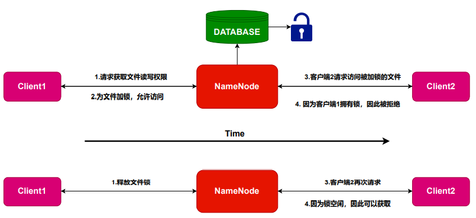

# miniHDFS

This is a basic implementation of HDFS(Hadoop Distributed File System) using gRPC for the entire communication


## Run the code

### Activate the program

* First start the `NameNode`

  ```
  python3 NameNode.py
  ```

* Second, start 1~4 `DataNode`s, and choose 1~4 as name

  ```
  python3 DataNode.py
  ```

* Finally start 1~4 `Clients`, and register/login

  ```
  python3 Client.py
  ```

### Other codes

* Initialize the database

  ```
  python3 initializeDB.py
  ```

* Display the database data

  ```
  python3 showDatabase.py
  ```

* Update gRPC service

  ```
   python3 -m grpc_tools.protoc -I. --python_out=. --grpc_python_out=. NameNode.proto
   python3 -m grpc_tools.protoc -I. --python_out=. --grpc_python_out=. DataNode.proto
  ```

## Demo


## Basic functions

* implemented some basic accessing operations like `ls`, `cd`, `mkdir`, `pwd`, using a filetree in json form

  

* Implemented  `upload` function

  

* Implemented  `download function

  

* Implemented  `delete` function

  

* Implemented  `copy` function

  

* Implemented  `atomic access` function

  

* Implemented  `permission management` function

  

* Implemented  `checksum` function

  

* Achieved final consistency

